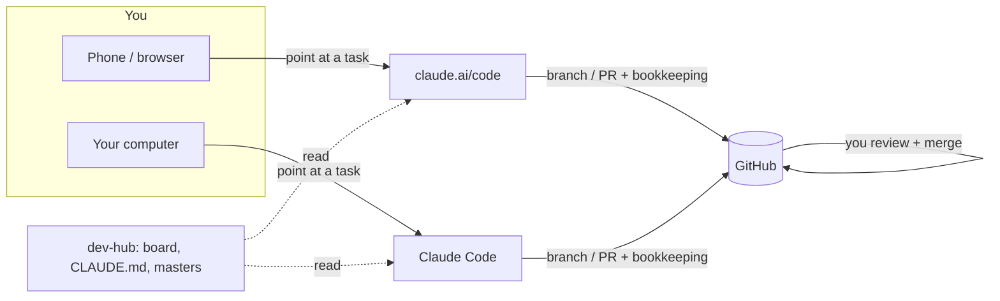

# dev-hub

> **This is the dev-hub template (v0.1.0).** Click **Use this template** on GitHub to make your
> own private `dev-hub`, then follow [§3 Setup](#3-setup). Everything starts empty.
> **New here?** See [`examples/`](examples/) for a filled-in board, repo master and task log,
> with a step-by-step walkthrough of one task. **Not using Claude?** See
> [`ADAPTING.md`](ADAPTING.md). Originally built by [Kyle Murphy](https://github.com/kylermurphy);
> MIT licensed ([`LICENSE`](LICENSE)).

## Mission Control

**dev-hub is mission control for development work across the repos you track.** You decide
which repos get tracked (`add-repo`). You add work yourself (`new-task`, `new-feature`), or
Claude finds it: `scan-repo` reads a repo and proposes tasks. Name a task or feature from
anywhere, and Claude works it on a branch and hands back a PR for you to review. `dev-hub` is
the source of truth for the backlog, the working conventions, and each repo's instruction file.
Claude works from here in the cloud (claude.ai/code) and on the machine (Claude Code), and all
of it lands on GitHub as branches and PRs you review. Above the boards, `projects/` keeps your
multi-month research projects, so the science and the code work stay connected.

It holds no code, just these:
- **The boards:** the task board lists every task across every tracked repo, each with an ID
  and a definition of done. The feature board holds larger work on long-lived branches.
- **The projects:** one file per research project, holding goals, objectives and work
  packages, plans, todos and a research log. Work packages link to the tasks and features that
  do the code work.
- **The playbook**: one set of rules every Claude session follows, wherever it runs.
- **The record**: a log of what each task and feature did, so any session can pick up where
  the last one stopped.

**Three levels of work**

| | Project | Feature | Task |
| --- | --- | --- | --- |
| What | A multi-month research initiative: goals, objectives, work packages | Several related code steps that belong together, e.g. a new module | One self-contained change: a fix, a test suite, a docs pass |
| Where it lives | `projects/<name>.md`, edited on `main` | `feature/<ID>-<slug>` for days or weeks; subtasks are committed onto it, with one PR at the end | `task/<ID>-<slug>`, one PR, merged when done |
| Tracked on | [`projects/INDEX.md`](projects/INDEX.md) | [`FEATURE_BOARD.md`](FEATURE_BOARD.md) | [`TASK_BOARD.md`](TASK_BOARD.md) |
| Guide | [`docs/PROJECTS.md`](docs/PROJECTS.md) | [`docs/FEATURES.md`](docs/FEATURES.md) (includes "Task or feature?") | [`docs/TASKS.md`](docs/TASKS.md) |

**Plan → Launch → Track → Land**
- **Plan**: `plan-task` agrees the approach with you, waits for your go, then saves it.
  `run-task` has Claude plan a simple task itself and go straight to a PR.
- **Launch**: name the task ID to get started, or batch a few together with `multi-task`. A
  feature's subtasks are worked one by one with `pickup-task`.
- **Track**: every step is logged; a simple memory bank lets a stopped task resume with
  `pickup-task`.
- **Land**: you merge the PR, which details all the work done, and `mark-done` closes it out
  on the board.

**Commands** ([`COMMANDS.md`](COMMANDS.md)). *Board maintenance:* `add-repo` ·
`refresh-overview` · `scan-repo` · `new-task` · `new-feature` · `check-board`. *Task
lifecycle:* `plan-task` · `run-task` · `multi-task` · `pickup-task` · `mark-done` (these take
task IDs, and feature or subtask IDs as well). *Projects:* `new-project` · `plan-project` ·
`review-projects`. Prefix any of them with `plan` for a dry run.

**Statuses:** ⏩ `Todo` not started · 🟠 `WIP` in progress (branch/PR open) · ‼️ `Blocked`
waiting on a decision · 🛑 `Usage-stopped` paused by usage limits · 🟢 `Done` merged. The boards
show the icon with the word; `TASK_LOG.md` and the logs use the word alone.

## Contents

| Path | What it is |
| --- | --- |
| [`README.md`](README.md) | This overview: what dev-hub is, surfaces and access, setup, memory. |
| [`docs/`](docs/) | The guides: [`TASKS.md`](docs/TASKS.md) (how tasks and batches run, with examples), [`FEATURES.md`](docs/FEATURES.md) (long-lived features, and when to use one) and [`PROJECTS.md`](docs/PROJECTS.md) (research projects). |
| [`projects/`](projects/) | Research projects: one file per project from [`TEMPLATE.md`](projects/TEMPLATE.md), and the portfolio in [`INDEX.md`](projects/INDEX.md). |
| [`CLAUDE.md`](CLAUDE.md) | Instructions for Claude in this hub, including the **full task protocol** (the only full copy), subagent guidance and memory rules. |
| [`TASK_BOARD.md`](TASK_BOARD.md) | The backlog: **Tracked Repos** (the list of repos), the Repo Overview, and one task table per repo. |
| [`FEATURE_BOARD.md`](FEATURE_BOARD.md) | Larger work on long-lived feature branches: one section per repo, each feature with a description and a subtask table. |
| [`COMMANDS.md`](COMMANDS.md) | Spec for every command, plus the `plan` dry-run prefix. |
| [`OVERNIGHT.md`](OVERNIGHT.md) | Running tasks while away: usage limits, guardrails, kick-off/resume prompts. |
| [`DECISIONS.md`](DECISIONS.md) | Why the workflow is the way it is: dated decisions. |
| [`TASK_LOG.md`](TASK_LOG.md) | Running index of tasks and features, in flight and done (newest first). |
| [`log/`](log/) | One write-up per task or feature (`<ID>.md`) from `log/TEMPLATE.md`: Status, Plan, Checklist, Next step, Blocked / open questions, notes. |
| [`repos/<name>/CLAUDE.md`](repos/) | **Master** instruction file for each target repo, including its `## Learnings`. Empty until `scan-repo` creates the first one. |
| [`templates/`](templates/) | The PR template every task PR follows (it stays here; Claude reads it from dev-hub, so it isn't copied into target repos), and `PROJECT_INSTRUCTIONS.md`, the custom instructions for a Claude Project in handback mode (see §2). |
| [`scripts/`](scripts/) | Helper scripts: `repo_stats.sh` (used by `refresh-overview` and `scan-repo`) and `check_board.py` (runs every `check-board` check). |
| [`.github/workflows/`](.github/workflows/) | CI: `check-board.yml` runs `scripts/check_board.py` on every PR and push to `main`. |
| [`examples/`](examples/) | A filled-in sample (`example-repo` with tasks `EX-1`…`EX-3` and feature `EX-FA`, plus a sample research project) and a step-by-step walkthrough. Read-only reference: your working files are the empty ones above. |
| [`AGENTS.md`](AGENTS.md) | One-line pointer to `CLAUDE.md`, for agents that look for `AGENTS.md`. |
| [`ADAPTING.md`](ADAPTING.md) | How to adapt dev-hub to another agent or ecosystem (untested). |
| [`CHANGELOG.md`](CHANGELOG.md), [`VERSION`](VERSION) | Template version history; current version. |
| [`LICENSE`](LICENSE) | MIT. |

---

## 1. How the pieces fit

- **dev-hub** (this repo, private) holds the board, the rules, the task records and the
  masters. No application code.
- **Target repos** (the repos in Tracked Repos) are the actual projects. Each carries a
  root `CLAUDE.md`, copied from its dev-hub master at the start of every task.
- **GitHub is the hub.** The cloud can't touch your machine, and Claude Code can't run when the
  machine is off. Both can reach GitHub, so work lands as a branch/PR you review (from your
  phone if needed) and can pull into Claude Code later.
- **Every task is self-contained**: branch, plan saved to its log, PR, log entry. It can be
  picked up by any later session from its board row and log alone, without the original chat.
  A feature works the same way, from its block on the feature board and its log.



## 2. Surfaces and access

| Surface | When | Private repos (incl. dev-hub) | Verified (upstream, v0.1.0) |
| --- | --- | --- | --- |
| **claude.ai/code** (Claude Code on the web) | Anytime, from any browser or phone; runs in the cloud | ✅ for the repos **attached** to the session. Branches, pushes, opens PRs. | ✅ tested and verified |
| **Claude Code** (on the machine), or a computer linked to an app chat | When the machine is on | ✅ via your local git credentials | ✅ tested and verified |
| **Claude Project (handback mode)**: a claude.ai Project with dev-hub synced as a GitHub source and `templates/PROJECT_INSTRUCTIONS.md` as its instructions | Anytime, any device; runs in the cloud | dev-hub is **read-only** (synced from `main`). Public target repos are cloned and worked on. ❌ Can't push: every change comes back as per-repo zips + patches for you to commit. | ✅ tested and verified |
| **Claude desktop app + GitHub MCP server** (runs locally in Docker, with a GitHub token) | When the machine is on | ✅ reads and writes through the GitHub API: bookkeeping, branches, commits, PRs. ❌ no shell, so it can't clone, build or run tests. | not yet verified |
| **Claude desktop app with computer use** (controls your computer; off by default) | When the machine is on and Computer use is turned on | ❌ not a route to repos by itself. Terminals and IDEs are click-only (no typing) and browsers are view-only, so it can't run git or tests. It can click Run in an IDE, read test output, or look at a rendered page. | not yet verified |

- **Public repos** clone anonymously from any session (read-only); pushing always needs auth.
  How a private repo gets authorized is **(Claude-specific)**: GitHub App installs, attached
  repos, local credentials. See [`ADAPTING.md` → Private-repo
  access](ADAPTING.md#2-private-repo-access).
- **Attach every repo a task touches**: usually the target repo **and** dev-hub (for the log).
- **Desktop app + GitHub MCP server.**
  - **Setup:** GitHub's [Claude Desktop guide](https://github.com/github/github-mcp-server/blob/main/docs/installation-guides/install-claude.md)
    (Docker, `claude_desktop_config.json`, then restart the app). The token needs `repo`
    access (fine-grained: Contents and Pull requests, read/write) on dev-hub and the target
    repos, plus `workflow` for tasks that add GitHub Actions files. GitHub's hosted remote
    server doesn't work in Claude Desktop yet, so this runs on your machine, and the web and
    mobile apps still can't reach private repos.
  - **Load the rules:** the desktop app doesn't read `CLAUDE.md` on its own. Use a Claude
    Project whose instructions say "read `<owner>/dev-hub/CLAUDE.md` through GitHub
    first".
  - **Best for:** planning, board commands, `mark-done` and other bookkeeping, and docs,
    content or config tasks. Tasks that need a build or tests to pass their definition of
    done belong in claude.ai/code or Claude Code.
- **Branch-restricted sessions.** Some cloud sessions can only push to one designated branch.
  There, a task's dev-hub bookkeeping arrives as a **dev-hub PR** instead of landing on
  `main`, and Claude says so in chat. Merge that PR to finish closing the task. Rules:
  `CLAUDE.md` → Branch-restricted sessions.

### Claude Project (handback mode)

**Setting it up**
1. Create a Project in claude.ai.
2. Link GitHub: in claude.ai, open **Settings → Connectors** and connect GitHub. On GitHub,
   install the [Claude GitHub App](https://github.com/apps/claude) on dev-hub (and on any
   repo you want the Project to see), so private repos show up.
3. Add dev-hub as a GitHub source via **Files**: branch `main`, the whole repo (this needs the
   GitHub integration authorized for the private repo).
4. Paste `templates/PROJECT_INSTRUCTIONS.md` into the Project's custom instructions.
5. Start a chat and type `how-to` for the quick guide (below), or name a task or command
   straight away. The first run creates `wc/LEDGER.md` with a sync snapshot.
6. Optional: turn on automatic approval of actions for the Project, so chats don't stop for
   tool approvals. The instructions already tell Claude not to ask in chat.

**Quick start: `how-to`**. Typing `how-to` at the start of any chat in the Project prints this
guide (copied word for word from `templates/PROJECT_INSTRUCTIONS.md`, so the two stay
identical):

> **How this Project works (handback mode)**
> Claude runs dev-hub tasks here but can't push to GitHub. Claude does the work; you commit it.
>
> **The loop**
> 1. Name a task or command: `do task EX-4`, `plan-task EX-4`,
>    `multi-task EX-4 EX-5`, `scan-repo example-repo`.
> 2. Claude checks for unfinished work (🚩) and whether dev-hub changed since the last run.
> 3. Claude clones the repo, does the work, keeps the bookkeeping in the Project's working
>    copy (`wc/`), and shows you the PR.
> 4. You reply "looks good". Claude runs `mark-done` and hands back one zip + one `.patch`
>    per repo.
> 5. You apply the patches, push, open the PR, and re-sync the Project's dev-hub source.
>
> **Example**
> - You: `do task EX-4`
> - Claude: "No unfinished work · dev-hub unchanged since <date>." … "Here's the PR for
>   `example-repo`. Look good?"
> - You: `looks good`
> - Claude: "Running `mark-done EX-4`." Handback: `example-repo-EX-4.patch`, `dev-hub-EX-4.patch`
>   (plus a zip for each).
>
> **Applying a patch is one command.** In GitHub Desktop: open the repo, pull `main`, then
> create the PR's branch (target repo) or stay on `main` (dev-hub). Then Repository →
> **Open in Command Prompt**:
> ```
> git am path_to_patch/example-repo-EX-4.patch
> ```
> Push, and you're done: the patch recreates the commits with their messages. If it fails,
> run `git am --abort` and upload the zip's files instead.
>
> **Good to know**
> - Keep each chat to one repo. For several tasks in one repo, use `multi-task`.
> - Only finished work is handed back. Anything unfinished is flagged 🚩 at the start of
>   every chat.
> - Re-sync the Project after committing; the next chat checks that it landed.
> - If a build or test can't run here, its checks are left in the PR for you.

**How it differs from the other surfaces**
- **No pushes.** A working copy in the Project's docs (`wc/dev-hub/…`) stands in for dev-hub
  `main`: copy-on-write, shared by every chat in the Project. `wc/LEDGER.md` records every
  action and a sync snapshot (each synced file's document ID).
- **Every run starts with checks**: an unfinished-work check (🚩 red flag if anything is open)
  and a sync check. The sync check compares document IDs with the snapshot. If dev-hub
  changed, it checks that handbacks landed, that outside edits merge cleanly, that rules
  still agree, and that the board is consistent.
- **A target-repo branch** lives as patches + `PR.md` in `wc/<repo>/<branch>/`.
- **Finishing:** Claude shows the PR, you confirm it, and Claude runs `mark-done` straight
  away, recording `Done (PR confirmed <date>)`, since you open and merge the PR yourself.
  dev-hub then gets one bookkeeping commit instead of WIP-then-Done commits, and never shows
  the intermediate states.
- **Handback:** one zip per repo (changed files at repo paths, a `.patch`, the PR text or
  commit message, and files to delete), plus each patch as a standalone file.
- **Patches carry real commits:** `git am` recreates each commit with its message and
  authorship, not just the file changes. One command per repo, from GitHub Desktop
  (Repository → Open in Command Prompt): `git am path_to_patch/<repo>-<ID>.patch`. If a patch
  won't apply, run `git am --abort` and upload the zip's files instead.
- **After committing**, re-sync the Project's GitHub source (syncing isn't instant). The next
  sync check confirms the handback landed and clears the working copy.

**Caveats**
- Several tasks can run in different chats at once, but **keep each chat to ONE repo**. Two
  chats on the same repo can overwrite each other's working-copy files, because Project docs
  are replaced whole, not merged. For several tasks in one repo, use `multi-task` in a single
  chat.
- The Project can only read the synced dev-hub in fragments, so the first working copy of a
  dev-hub file is rebuilt from them. The handback flags those files; check GitHub's diff shows
  only the intended changes.
- Target repos must be **public** (they're cloned anonymously).
- The cloud sandbox's network allowlist can block package registries (e.g. rubygems), so some
  builds/tests can't run there. Those checks are left in the PR for you.
- "PR confirmed" isn't "merged". The sync check flags a confirmed task whose change never
  reached the target repo's `main`.

## 3. Setup

0. **Create your hub from this template.** On GitHub, click **Use this template** → **Create a
   new repository**, name it `dev-hub`, and make it **private**. Replace `<owner>` in the docs
   with your GitHub user or org (it appears in a few example commands and links), and set
   `DEVHUB_OWNER=<owner>` in your shell or environment so `scripts/repo_stats.sh` and
   `add-repo` can expand bare repo names.

Then give sessions access:

1. **GitHub access.** Install the Claude GitHub App on dev-hub and every tracked repo, and
   connect GitHub in claude.ai. Only then can claude.ai/code push and open PRs.
2. **Cloud sessions.** Start a claude.ai/code session with **dev-hub and the target repo**
   attached. Its environment needs network access to github.com for cloning public repos.
3. **Local.** Clone dev-hub next to your project checkouts so Claude Code can read the board
   and write logs:
   `git clone git@github.com:<owner>/dev-hub.git`.
4. **Claude Project (optional).** Set up a Project in handback mode: see §2 → Claude Project
   (handback mode).
5. **Desktop app (optional).** Add the GitHub MCP server to the Claude desktop app and make
   a Project that loads dev-hub's `CLAUDE.md` (see §2).
6. **Add a repo.** `add-repo <owner/name>` → `refresh-overview` → `scan-repo <name>`. This
   adds it to Tracked Repos and builds its task section and `CLAUDE.md` master. The master
   reaches the repo on its first task. There's no manual seeding.

## 4. How work runs

Each way of working has its own guide:
- **[`docs/TASKS.md`](docs/TASKS.md):**
  - the task board;
  - a task end to end, and batches of simple tasks;
  - defaults: handback, autonomy, model choice, overnight runs;
  - the commands, and examples from each surface.
- **[`docs/FEATURES.md`](docs/FEATURES.md):**
  - task or feature?;
  - the feature board;
  - a feature end to end, stops and changes of plan;
  - examples.
- **[`docs/PROJECTS.md`](docs/PROJECTS.md):**
  - the three levels of work;
  - a project file, section by section;
  - starting, planning, day-to-day updates and reviews;
  - making projects easy to plan from.
- **[`OVERNIGHT.md`](OVERNIGHT.md):** running tasks while you're away.

The rules behind them are in [`CLAUDE.md`](CLAUDE.md), the only full copy. Every command is
specified in [`COMMANDS.md`](COMMANDS.md).

## 5. Instructions and memory

| What | Where | Read by |
| --- | --- | --- |
| Rules for working in dev-hub, and the task protocol | `CLAUDE.md` (this repo) | Sessions in dev-hub |
| Project rules (build/test, layout, gotchas) + `## Learnings` | `CLAUDE.md` at each repo root, copied from its master `repos/<name>/CLAUDE.md` | Claude Code + claude.ai/code in that repo |
| Why the workflow is the way it is | `DECISIONS.md` | Anyone changing the workflow |
| Per-task history | `log/<ID>.md` + `TASK_LOG.md` | `pickup-task`, `mark-done`, you |
| Personal preferences | the claude.ai app's own memory | App only; not for repo specifics |

- **Edit instructions in the master**, never in a repo's root copy. The copy is replaced at the
  start of each task, which is also how edits reach the repo. A repo's copy only catches up at
  its next task; that's expected.
- **Learnings:** during a task, lasting findings go in the log as `Learning:` lines.
  `mark-done` promotes them into the master's `## Learnings` (≈15 max; `scan-repo` prunes).
- **Changing the workflow:** edit `CLAUDE.md` first, then its summaries (this README, the
  guides in `docs/`, `COMMANDS.md`, the masters' compact protocol), and add a line to
  `DECISIONS.md`.

---

This repo is **private**; keep it private, and never commit secrets or credentials.
