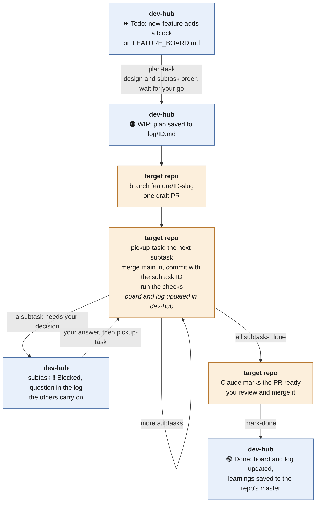
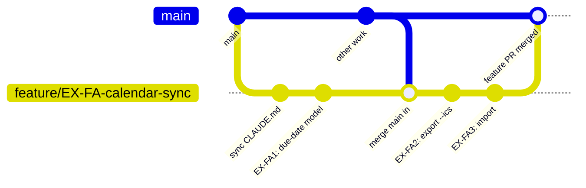

# Features

A **feature** is larger work in one repo that stays on its own branch until it's finished as a
whole: a new module, a model change that has to be validated before it replaces the old one, an
API change that only makes sense in full. It's broken into **subtasks** that are committed
straight onto the feature branch, and it reaches `main` in one PR at the end. Features live on
[`FEATURE_BOARD.md`](../FEATURE_BOARD.md), grouped by repo. The rules are in
[`CLAUDE.md`](../CLAUDE.md) → Features, and the commands in [`COMMANDS.md`](../COMMANDS.md).
For everyday work, see [`TASKS.md`](TASKS.md).

## Task or feature?

| | Task | Batch | Feature |
| --- | --- | --- | --- |
| Size | one change, S to L | up to 5 small tasks | several related steps, days to weeks |
| Branch | `task/<ID>-<slug>` | `task/<ID>+<ID>+…-<slug>` | `feature/<ID>-<slug>`, kept until the feature is finished |
| PRs | one per task | one for the batch | one for the feature; subtasks have none |
| Reaches `main` | when you merge it | together, when you merge | together, when the whole feature is done |
| Records | a log and `TASK_LOG.md` row per task | per task | one log and one row for the feature |
| Board | `TASK_BOARD.md` | `TASK_BOARD.md` | `FEATURE_BOARD.md` |

**Use a feature** when the steps belong together and `main` shouldn't get them one at a time,
and there are three or more of them. For example: half a new API would confuse users, a new
module isn't useful until it's complete, or research code needs validating before it replaces
the old path.

**Stay with tasks** when each step is useful on its own. Merging as you go keeps reviews small
and `main` current, and long-lived branches drift. When in doubt, use tasks.

## The feature board

Each repo with features has a section, and each feature is a block like this one (shortened
from [`examples/FEATURE_BOARD.example.md`](../examples/FEATURE_BOARD.example.md)):

```markdown
### EX-FA — Calendar sync: export and import to-dos as iCalendar

**Status** ⏩ Todo · **Branch** — · **PR** — · **Log** —

**Description.** Lets `todo` share due dates with any calendar app. … Export and import share
one date model, so they stay on one branch and reach `main` together.

**Done when.** Every subtask is done: `todo export --ics` and `todo import` round-trip a list
without loss, … and CI passes on the feature PR.

| ID | Status | Subtask | Type | Effort | Definition of done |
| --- | --- | --- | --- | --- | --- |
| EX-FA1 | ⏩ Todo | Add a shared due-date model with time zones … | Refactor | M | … |
| EX-FA2 | ⏩ Todo | `todo export --ics` … | Feature | M | … |
```

The parts of a block:
- **IDs:** the feature is the repo prefix + `F` + a letter (`EX-FA`, then `EX-FB`). Its
  subtasks add a number (`EX-FA1`, `EX-FA2`). Subtasks are numbered inside the feature,
  and no ID is ever reused.
- **Status line:** it sits under the heading, so the heading's link stays the same while the
  status changes. Branch, PR and Log read `—` until `plan-task` creates them.
- **Description:** 2–4 sentences on what the feature builds and why it's one branch. Agents
  read it before the table, so write it for a reader who has never seen the repo.
- **Done when:** the feature's own definition of done. Each subtask also has one.
- **Subtasks:** ideally S or M each. An L subtask is split when the feature is planned.

## A feature, end to end



Each box says where the step happens: blue in dev-hub (the board, log and masters), orange in
the target repo (the branch and PR).

1. **Add it:** `new-feature <repo>`. Describe the feature; Claude writes the block with the
   repo's next letter and proposes the subtasks.
2. **Plan and start it:** `plan-task <feature ID>`. You agree the design and the order of the
   subtasks, and Claude splits any L subtask. It waits for your go (features can't use
   `run-task`). Then it:
   - creates `feature/<ID>-<slug>` in the target repo, with the `CLAUDE.md` sync as its first
     commit;
   - saves the plan to `log/<ID>.md`, adds a `TASK_LOG.md` row and sets the feature `WIP`.
     That's the feature's only log and row: subtasks get none of their own, and the log keeps
     a checklist item per subtask;
   - opens **one draft PR** into `main` straight away. CI runs on every push, so you can
     watch the combined diff grow.
3. **Work the subtasks:** `pickup-task <subtask ID>`, or `pickup-task <feature ID>` for the
   next one. For each subtask, Claude:
   - merges `main` into the feature branch first, so it doesn't drift;
   - commits straight onto the branch, each commit prefixed with the subtask ID
     (`EX-FA2: add the ics writer`);
   - runs the repo's checks;
   - sets the subtask `Done`, ticks it in the feature log and names the next one.

   Any session or surface can pick up where the last one stopped.
4. **Review:** when every subtask is done, Claude marks the PR ready. Review it as a whole, or
   commit by commit, since the subtask-ID prefixes group the commits.
5. **Land:** merge the PR, then run `mark-done <feature ID>`. It checks the merge and that
   every subtask is `Done`, sets the feature `Done`, and promotes any `Learning:` notes into
   the repo's master.

Features need a surface that can push: Claude Code on the web, in the Claude app, or on your
computer. A Claude Project in handback mode doesn't run them ([`SURFACES.md`](SURFACES.md)).

### The feature branch

The branch lives for the whole feature. `main` is merged in before each subtask, so the branch
doesn't drift, and the draft PR opened at the start shows the combined diff growing, with CI on
every push. Nothing reaches `main` until you merge that one PR:



## Stops and changes of plan

- **A subtask needs your decision:** it's `Blocked` in the table, with the question in the
  feature log. Other subtasks can carry on.
- **The whole feature stops:** it's `Blocked` or `Usage-stopped`, like a task. `pickup-task`
  resumes it from the log's Next step.
- **New work turns up:** append a subtask row with the next number. No command is needed.
- **A subtask isn't needed after all:** remove its row and say why in the feature log. Its ID
  isn't reused.
- **Tasks that belong in a feature:** `new-feature` can move `Todo` tasks in. Each keeps its
  text plus "(was <old ID>)", its row leaves `TASK_BOARD.md`, and a note there maps old IDs to
  new. For example, EX-4, 5 and 6 could become EX-FA1–FA3.

## Examples

> "new-feature example-repo: calendar sync, so to-dos can be exported to and imported from
> iCalendar files."

Claude adds `EX-FA` with a description and proposed subtasks for you to adjust.

> "plan-task **EX-FA**."

Claude reads the block, clones `example-repo` and proposes a design and order: for example,
FA1 (the date model) first, then FA2 (export), then FA3 (import), then FA4 (docs). Once you
agree, it creates the branch and log and opens the draft PR.

> "pickup-task **EX-FA**." · "pickup-task **EX-FA3**, do the import next."

> "mark-done **EX-FA**." (after you merge the feature PR)
