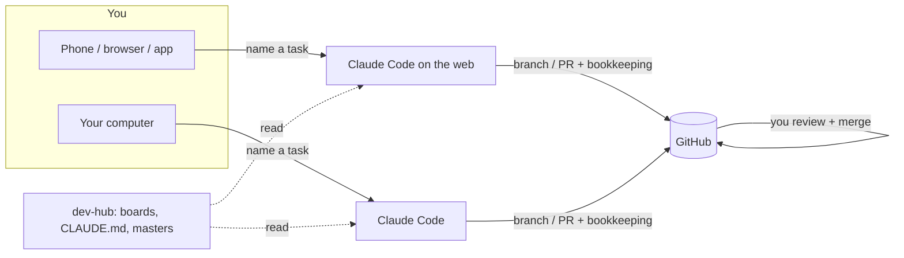

# Surfaces: where dev-hub runs

dev-hub works from several Claude surfaces. This guide covers what each one can reach, how to
set it up, and what to watch for. The short version is in
[README → Where it runs](../README.md#where-it-runs). The rules every surface follows are in
[`CLAUDE.md`](../CLAUDE.md).

## GitHub is the hub

The surfaces can't see each other. A cloud session can't touch your machine, Claude Code can't
run when the machine is off, and a chat's context is gone once it ends. **All of them can reach
GitHub**, so all state lives there:
- dev-hub (private) holds the boards, the rules, the logs and the repo masters;
- work lands as branches and PRs you review, from your phone if needed, and can pull into Claude
  Code later;
- any session can pick up any task or feature from its board entry and log alone, without the
  original chat.



## The surfaces

| Surface | When | Private repos (incl. dev-hub) | Verified (upstream) |
| --- | --- | --- | --- |
| **Claude Code on the web or in the Claude app** ([claude.ai/code](https://claude.ai/code)) | Anytime, from any browser, phone or the app; runs in the cloud | ✅ for the repos **attached** to the session. Branches, pushes, opens PRs. | ✅ tested and verified |
| **Claude Code** (on the machine), or a computer linked to an app chat | When the machine is on | ✅ via your local git credentials | ✅ tested and verified |
| **Claude Project (handback mode)**: a claude.ai Project with dev-hub synced as a GitHub source and `templates/PROJECT_INSTRUCTIONS.md` as its instructions | Anytime, any device; runs in the cloud | dev-hub is **read-only** (synced from `main`). Public target repos are cloned and worked on. ❌ Can't push: every change comes back as per-repo zips + patches for you to commit. Tasks, batches, board maintenance and projects; not features. | ✅ tested and verified for tasks |
| **Claude desktop app + GitHub MCP server** (runs locally in Docker, with a GitHub token) | When the machine is on | ✅ reads and writes through the GitHub API: bookkeeping, branches, commits, PRs. ❌ no shell, so it can't clone, build or run tests. | not yet verified |
| **Claude desktop app with computer use** (controls your computer; off by default) | When the machine is on and Computer use is turned on | ❌ not a route to repos by itself. Terminals and IDEs are click-only (no typing) and browsers are view-only, so it can't run git or tests. It can click Run in an IDE, read test output, or look at a rendered page. | not yet verified |

## Claude Code on the web or in the Claude app

- **Attach every repo a task touches**: usually the target repo **and** dev-hub (for the log).
- **Public repos** clone anonymously (read-only). Pushing always needs the Claude GitHub App
  installed on the repo, and GitHub connected in claude.ai (**Settings → Connectors**). How a
  private repo gets authorized is **(Claude-specific)**: GitHub App installs, attached repos,
  local credentials. See [`ADAPTING.md` → Private-repo
  access](../ADAPTING.md#2-private-repo-access).
- The session's environment needs network access to github.com for cloning public repos.
- **Branch-restricted sessions.** Some cloud sessions can only push to one designated branch.
  There, a task's dev-hub bookkeeping arrives as a **dev-hub PR** instead of landing on
  `main`, and Claude says so in chat. Merge that PR to finish closing the task. Rules:
  `CLAUDE.md` → Branch-restricted sessions.

## Claude Code on your computer

- Clone dev-hub next to your project checkouts, so Claude Code can read the boards and write
  the logs: `git clone git@github.com:<owner>/dev-hub.git`.
- It pushes and opens PRs with your local git credentials, so it works only while the machine
  is on. A computer linked to an app chat works the same way.

## Claude desktop app + GitHub MCP server (not yet verified)

- **Setup:** GitHub's [Claude Desktop guide](https://github.com/github/github-mcp-server/blob/main/docs/installation-guides/install-claude.md)
  (Docker, `claude_desktop_config.json`, then restart the app). The token needs `repo`
  access (fine-grained: Contents and Pull requests, read/write) on dev-hub and the target
  repos, plus `workflow` for tasks that add GitHub Actions files. GitHub's hosted remote
  server doesn't work in Claude Desktop yet, so this runs on your machine, and the web and
  mobile apps still can't reach private repos.
- **Load the rules:** the desktop app doesn't read `CLAUDE.md` on its own. Use a Claude
  Project whose instructions say "read `<owner>/dev-hub/CLAUDE.md` through GitHub
  first".
- **Best for:** planning, board commands, `mark-done` and other bookkeeping, and docs,
  content or config tasks. Tasks that need a build or tests to pass their definition of
  done belong in Claude Code on the web or on your computer.

## Claude desktop app with computer use (not yet verified)

Computer use isn't a route to repos by itself: terminals and IDEs are click-only (no typing)
and browsers are view-only, so it can't run git or tests. It can click Run in an IDE, read test
output, or look at a rendered page.

## Claude Project (handback mode)

A claude.ai Project with dev-hub synced read-only and `templates/PROJECT_INSTRUCTIONS.md` as its
instructions. It runs anywhere, with no Claude Code, but it can't push: Claude does the work
and hands it back as patches for you to commit.

**What works here**
- **Tasks and batches** (`run-task`, `plan-task`, `multi-task`, `pickup-task`, `mark-done`),
  and board maintenance. Target repos must be **public**.
- **Projects** (`new-project`, `plan-project`, `review-projects`, and everyday project edits):
  they only change dev-hub, so they come back as a dev-hub patch.
- **Not features.** A feature's subtasks go onto a long-lived branch with `main` merged in
  before each one, and a `git am` patch can't carry a merge commit. Handback also only returns
  finished work (PR confirmed, `mark-done` run), which a subtask never is. Run features from
  Claude Code, on the web or on your computer.

**Setting it up**
1. Create a Project in claude.ai.
2. Link GitHub: in claude.ai, open **Settings → Connectors** and connect GitHub. On GitHub,
   install the [Claude GitHub App](https://github.com/apps/claude) on dev-hub (and on any
   repo you want the Project to see), so private repos show up.
3. Add dev-hub as a GitHub source via **Files**: branch `main`, the whole repo (this needs the
   GitHub integration authorized for the private repo).
4. Paste `templates/PROJECT_INSTRUCTIONS.md` into the Project's custom instructions.
5. Start a chat and type `how-to` for the quick guide (below), or name a task or command
   straight away. The first run creates `wc/LEDGER.md` with a sync snapshot.
6. Optional: turn on automatic approval of actions for the Project, so chats don't stop for
   tool approvals. The instructions already tell Claude not to ask in chat, except that
   `plan-task` and `plan-project` wait for your go.

**Quick start: `how-to`**. Typing `how-to` at the start of any chat in the Project prints this
guide (copied word for word from `templates/PROJECT_INSTRUCTIONS.md`, so the two stay
identical):

> **How this Project works (handback mode)**
> Claude runs dev-hub tasks here but can't push to GitHub. Claude does the work; you commit it.
>
> **The loop**
> 1. Name a task or command: `do task EX-4` (Claude plans it and goes), `plan-task EX-4`
>    (Claude posts a plan and waits for your go), `multi-task EX-4 EX-5`,
>    `scan-repo example-repo`, or a project command such as `new-project` or `plan-project`.
> 2. Claude checks for unfinished work (🚩) and whether dev-hub changed since the last run.
> 3. Claude clones the repo, does the work, keeps the bookkeeping in the Project's working
>    copy (`wc/`), and shows you the PR.
> 4. You reply "looks good". Claude runs `mark-done` and hands back one zip + one `.patch`
>    per repo.
> 5. You apply the patches, push, open the PR, and re-sync the Project's dev-hub source.
>
> **Example**
> - You: `do task EX-4`
> - Claude: "No unfinished work · dev-hub unchanged since <date>." … "Here's the PR for
>   `example-repo`. Look good?"
> - You: `looks good`
> - Claude: "Running `mark-done EX-4`." Handback: `example-repo-EX-4.patch`, `dev-hub-EX-4.patch`
>   (plus a zip for each).
>
> **Applying a patch is one command.** In GitHub Desktop: open the repo, pull `main`, then
> create the PR's branch (target repo) or stay on `main` (dev-hub). Then Repository →
> **Open in Command Prompt**:
> ```
> git am path_to_patch/example-repo-EX-4.patch
> ```
> Push, and you're done: the patch recreates the commits with their messages. If it fails,
> run `git am --abort` and upload the zip's files instead.
>
> **Good to know**
> - Keep each chat to one repo. For several tasks in one repo, use `multi-task`.
> - Only finished work is handed back. Anything unfinished is flagged 🚩 at the start of
>   every chat.
> - Re-sync the Project after committing; the next chat checks that it landed.
> - If a build or test can't run here, its checks are left in the PR for you.
> - Features need Claude Code (on the web or your computer); this Project doesn't run them.

**How it differs from the other surfaces**
- **No pushes.** A working copy in the Project's docs (`wc/dev-hub/…`) stands in for dev-hub
  `main`: copy-on-write, shared by every chat in the Project. `wc/LEDGER.md` records every
  action and a sync snapshot (each synced file's document ID).
- **Every run starts with checks**: an unfinished-work check (🚩 red flag if anything is open)
  and a sync check. The sync check compares document IDs with the snapshot. If dev-hub
  changed, it checks that handbacks landed, that outside edits merge cleanly, that rules
  still agree, and that the board is consistent.
- **A target-repo branch** lives as patches + `PR.md` in `wc/<repo>/<branch>/`.
- **Finishing:** Claude shows the PR, you confirm it, and Claude runs `mark-done` straight
  away, recording `Done (PR confirmed <date>)`, since you open and merge the PR yourself.
  dev-hub then gets one bookkeeping commit instead of WIP-then-Done commits, and never shows
  the intermediate states.
- **Handback:** one zip per repo (changed files at repo paths, a `.patch`, the PR text or
  commit message, and files to delete), plus each patch as a standalone file.
- **Patches carry real commits:** `git am` recreates each commit with its message and
  authorship, not just the file changes. One command per repo, from GitHub Desktop
  (Repository → Open in Command Prompt): `git am path_to_patch/<repo>-<ID>.patch`. If a patch
  won't apply, run `git am --abort` and upload the zip's files instead.
- **After committing**, re-sync the Project's GitHub source (syncing isn't instant). The next
  sync check confirms the handback landed and clears the working copy.

**Caveats**
- Several tasks can run in different chats at once, but **keep each chat to ONE repo**. Two
  chats on the same repo can overwrite each other's working-copy files, because Project docs
  are replaced whole, not merged. For several tasks in one repo, use `multi-task` in a single
  chat.
- The Project can only read the synced dev-hub in fragments, so the first working copy of a
  dev-hub file is rebuilt from them. The handback flags those files; check GitHub's diff shows
  only the intended changes.
- Target repos must be **public** (they're cloned anonymously).
- The cloud sandbox's network allowlist can block package registries (e.g. rubygems), so some
  builds/tests can't run there. Those checks are left in the PR for you.
- "PR confirmed" isn't "merged". The sync check flags a confirmed task whose change never
  reached the target repo's `main`.
