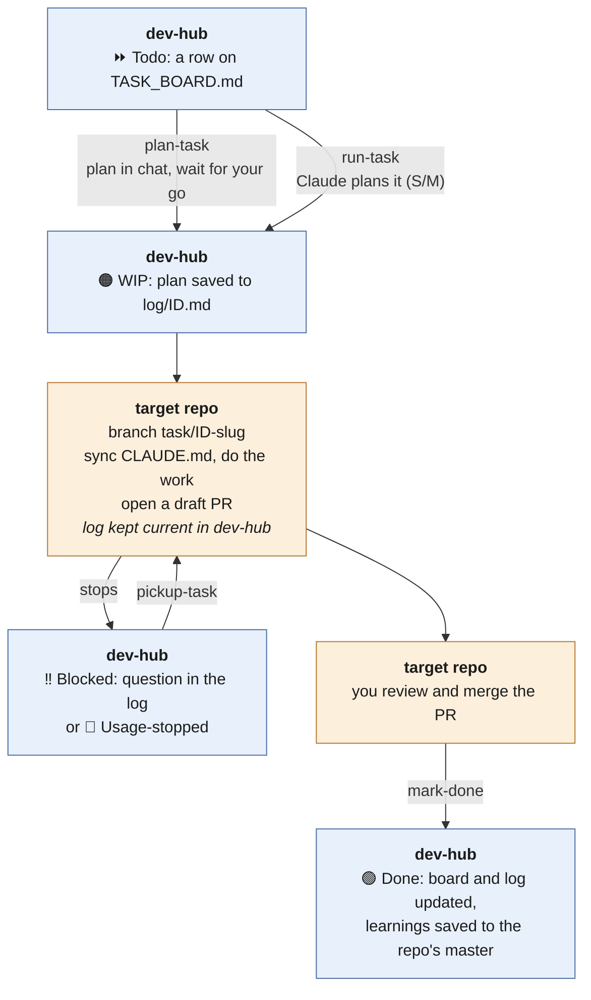

# Tasks

A **task** is one self-contained piece of work in one repo: a fix, a test suite, a docs pass.
It gets one branch and one PR, and reaches `main` as soon as you merge it. This guide explains
how tasks run day to day. The rules themselves are in [`CLAUDE.md`](../CLAUDE.md) → Task
protocol, and every command is specified in [`COMMANDS.md`](../COMMANDS.md). For larger work
that needs its own branch for days or weeks, see [`FEATURES.md`](FEATURES.md).

## How a task works

- **dev-hub holds the record; the code stays in the target repo.** The task's row, plan and
  log live in dev-hub. The work lands as a branch and a draft PR in the target repo.
- **Each target repo carries a root `CLAUDE.md`,** copied from its dev-hub master
  (`repos/<name>/CLAUDE.md`) as the first commit of every task. It tells the session how to
  build and test that repo, and what earlier tasks learned. Edit the master, never the copy.
- **Every task is self-contained.** Its board row (with the definition of done) and its log are
  enough for any later session, on any surface, to pick it up without the original chat. See
  [`SURFACES.md`](SURFACES.md) for where tasks can run.

## The board

[`TASK_BOARD.md`](../TASK_BOARD.md) groups tasks by repo, with one section per tracked repo.
Each row is a task:
- an ID, e.g. `EX-1`;
- a type;
- an effort: **S** ≈ under an hour · **M** ≈ a focused session · **L** ≈ multi-session, or
  needs a design call first;
- a **definition of done**, which is the task's acceptance test.

Add work with `new-task <repo>` or by editing the table. `scan-repo <name>` reads a repo and
proposes new tasks. Each repo's name in the **Tracked Repos** table links to its section.

**Statuses:** ⏩ `Todo` not started · 🟠 `WIP` in progress (branch/PR open) · ‼️ `Blocked`
waiting on a decision · 🛑 `Usage-stopped` paused by usage limits · 🟢 `Done` merged. The board
shows the icon with the word; `TASK_LOG.md` and the logs use the word alone.

## A task, end to end

Each box says where the step happens: blue in dev-hub (the board, log and masters), orange in
the target repo (the branch and PR).

1. **Plan it, one of two ways.**
   - **`plan-task <ID>`:** Claude posts a plan in chat and **waits for your go**. You refine it
     together, and only "go" starts the work. Answering its questions isn't a go.
   - **`run-task <ID>`**, or just naming the ID: Claude writes the plan itself and carries on.
     It only stops for the "When to stop and ask" rules in `CLAUDE.md` (an unclear definition
     of done, a design choice nothing settles, something irreversible, work bigger than the
     row, repeated failures). This is for **S/M** tasks with a clear definition of done.

   Either way, the plan (including which steps go to cheaper subagents) is saved to
   `log/<ID>.md`, and the task is set `WIP`.
2. Claude branches `task/<ID>-<slug>` in the target repo. The first commit syncs its
   `CLAUDE.md` from dev-hub. Then it does the work and opens a **draft PR** whose description
   follows dev-hub's PR template.
3. The bookkeeping (`log/<ID>.md`, a `TASK_LOG.md` row, the board Status) is committed
   straight to dev-hub `main`, or via a dev-hub PR in a branch-restricted session.
4. If it stops, it's `Blocked` (with a question for you in the log) or `Usage-stopped`.
   `pickup-task <ID>` resumes from the log's **Next step**. A run cut off mid-way stays `WIP`
   and is still resumable.
5. You review and merge the PR, then run `mark-done <ID>`. It checks the merge, sets `Done`
   everywhere, and promotes any `Learning:` notes into the repo's master.

## Several simple tasks at once

Rules: [`CLAUDE.md`](../CLAUDE.md) → Batches.

Run `multi-task EX-3 EX-4 EX-5`, or `multi-task example-repo` to have Claude propose a
batch of that repo's `Todo` **S** tasks. A batch must be in one repo, with no **L** tasks and
at most 5 tasks. It gets one branch (`task/EX-3+EX-4+EX-5-…`) and **one PR**.
- Each task keeps its own log, `TASK_LOG.md` row and Status. Commits are prefixed with their
  task ID, and the PR has a section per task.
- A task that needs your decision is dropped from the batch as `Blocked`; the rest still
  ship.
- For a batch that needs a real plan first, use `plan-task EX-3 EX-4 …`. Close it after
  merge with `mark-done EX-3 EX-4 EX-5`.

## Defaults

- **Handback:** a draft PR; a patch/diff only when the session can't push (a Claude Project in
  handback mode: [`SURFACES.md`](SURFACES.md)).
- **Autonomy:** `run-task`, `multi-task`, `pickup-task` and overnight runs carry on without you
  and go to a draft PR. They stop only under [`CLAUDE.md`](../CLAUDE.md) → When to stop and
  ask: they ask in chat if you're there, and otherwise set `Blocked` with the question in the
  log rather than guessing.
- **Model:** the cheapest model that reliably does the task:
  - **S**: fast (Haiku or Sonnet);
  - **M**: Sonnet;
  - **L** or design work while you're present: the most capable (Opus or Fable).

  Broad or mechanical sub-jobs can go to cheaper **subagents** (`CLAUDE.md` → Subagents).
- **Overnight:** S/M tasks only, one per run (or one `multi-task` batch of S tasks), finished
  early enough for the usage window to reset. Prompts and guardrails are in
  [`OVERNIGHT.md`](../OVERNIGHT.md).

## Commands

Every command is in the [README's command table](../README.md#commands) and specified in
[`COMMANDS.md`](../COMMANDS.md). The ones that run tasks follow the full protocol:
- `plan-task <ID> …`: one ID, or several to plan a batch; always waits for your go;
- `run-task <ID>`: Claude plans and runs one S/M task without waiting;
- `multi-task <ID> <ID> …`: several simple tasks, one PR;
- `pickup-task <ID>`: resumes from the log's Next step;
- `mark-done <ID> …`: one ID or a batch, after the merge.

Board maintenance (`add-repo`, `scan-repo`, `new-task`, …) is lightweight: a `chore/` branch +
PR on dev-hub, with no log or Status. Prefix any command with `plan` (e.g. "plan scan-repo
example-repo") for a proposal with no commits; say "go" to run it. `plan-task` is the one that
*saves* a plan.

## Examples

**From Claude Code on the web or in the Claude app** (dev-hub + target repo attached; machine
off or you're mobile):
> "plan-task **EX-2**."

Claude reads the board, clones `example-repo` and proposes a plan. Once you agree, it saves the plan
to `log/EX-2.md`, sets `WIP`, branches, syncs `example-repo`'s `CLAUDE.md`, adds the CI workflow,
and opens a draft PR you can review from your phone.

> "pickup-task **EX-4**. Answer to the open question: sort `--json` output by due date."

> "run-task **EX-6**." Claude plans it, saves the plan, adds the `--version` flag and opens a
> draft PR, and only stops to ask if it hits a stop rule.

> "mark-done **EX-2**." (after you merge)

> "multi-task **example-repo**." Claude proposes, say, EX-3, EX-4 and EX-5. You
> confirm, and one PR comes back with a section per task. After merging:
> "mark-done EX-3 EX-4 EX-5".

> "new-task example-repo: add a `CHANGELOG.md`. Effort S."

**From a Claude Project (handback mode)** (any device, no push access):
> "do task **EX-3**." … "looks good"

Claude checks for unfinished work and whether dev-hub changed, does the work, shows you the PR,
and on "looks good" runs `mark-done` and hands back one zip + one `.patch` per repo. You apply
each with `git am`, push, open the PR, and re-sync the Project. Setup and details:
[`SURFACES.md`](SURFACES.md) → Claude Project (handback mode).

**From Claude Code on your computer:**
> In the `dev-hub` checkout: "Pull latest, then plan-task **EX-4** in the `example-repo` repo
> next door. Branch + PR."

> Hand off between surfaces: start `EX-5` from claude.ai/code while you're out, then at your
> machine: "pickup-task EX-5: run the suite and finish it off."
